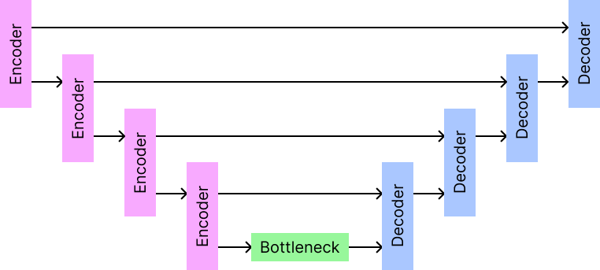

[](https://classroom.github.com/a/ifbeTrPr)

# Animation Video Frame Interpolation

We explore a sophisticated method for video frame interpolation in cartoon videos, utilizing a specially designed optical flow model with enhanced skip connections. The method leverages motion information to generate intermediate frames between consecutive frames effectively. By employing a U-Net architecture with a ResNet-based encoder and decoder, enhanced by attention modules, our approach precisely interpolates frames by focusing on areas with significant motion. The use of a composite loss function combining multilayer Perceptual loss and L1 loss helps capture the unique motion and style characteristics inherent to cartoon animations. This technique is especially suited for animated media that demands precise motion representation.


## Setup

1. Clone this repository:

   ```bash
   git clone https://github.com/ecbme6040/e6691-2024spring-project-skar-sb4839-kg3081-av3180.git
   ```

2. Install the dependencies:

   ```bash
   pip install -r requirements.txt
   ```

3. Create the dataset:

   1. Download the [ATD12K dataset](https://github.com/lisiyao21/AnimeInterp).
   2. Run the following command:

      ```bash
      cd utils
      python dataset_creation.py
      ```

      This command generates `image_data.h5`.

## Model Training

1. Optical Flow Prediction

   ```bash
   torchrun --nproc_per_node=1 main.py --batch_size=16 --epochs=20 --data_path="image_data.h5" --mode="train" --task="optFlow"
   ```

2. Video Frame Interpolation

   ```bash
   torchrun --nproc_per_node=1 main.py --batch_size=16 --epochs=20 --data_path="image_data.h5" --mode="train" --type=1 --task="vfi"
   ```

### Parameters

- `batch_size`: Batch size for training.
- `epochs`: Number of training epochs.
- `data_path`: Path to the file containing image features.
- `lr`: Learning rate for the optimizer.
- `wd`: Weight decay parameter for the optimizer.
- `type`: Model type, where 0 = Simple UNet, 1 = ResUNet, 2 = TransUNet.
- `path`: Path to the pretrained model weights (if applicable).
- `task`: "optFlow" for Optical Flow Prediction, "vfi" for Video Frame Interpolation
- `rank`, `local_rank`, `world_size`, `workers`: Parameters for the distributed training setup.

## Model Inference

1. Optical Flow Prediction

   ```bash
   torchrun --nproc_per_node=1 main.py --batch_size=16 --data_path="image_data.h5" --mode="predict" --type=1 --path="optFlow_model_20240507_065119.pth" --task="optFlow"
   ```

2. Video Frame Interpolation

   ```bash
    torchrun --nproc_per_node=1 main.py --batch_size=1 --data_path="image_data.h5" --mode="predict" --type=1 --path="best_model_20240507_080647.pth" --task="vfi"
   ```

### Parameters

- `batch_size`: Batch size for testing.
- `data_path`: Path to the file containing image features.
- `type`: Model type.
- `path`: Path to the pretrained model weights (if applicable).
- `task`: "optFlow" for Optical Flow Prediction, "vfi" for Video Frame Interpolation

## Example Predictions

Ground Truth (Top), Predictions (Middle), Loss Function (Bottom):


## Evaluation Curves

VFI Training and Testing; Loss, SSIM and PSNR Graphs

<div style="display:flex">


</div>
<div style="display:flex">


</div>
<div style="display:flex">


</div>

## Model Architecture

1. Video Frame Interpolation



We have enhanced the U-Net architecture by integrating ResNet blocks within both the encoder and decoder pathways to improve feature extraction capabilities and support gradient flow during training.


The encoder features a ResNet block followed a mask based attention mechanism and a downsampling layer, while the decoder incorporates a ResNet block with another attention layer and an upsampling operation. This design leverages deep residual learning to facilitate training deeper networks by alleviating the vanishing gradient problem, thereby enhancing its effectiveness for accurate image colorization.

## Key Links and References

1. [Presentation](https://docs.google.com/presentation/d/1w8uYI0eEoEiHSBr9WAcMVZ9kfmzaC22X78z5iE_-GAQ/edit?usp=sharing)

2. [Trained Model](https://drive.google.com/drive/folders/1IUeSfMIR641CMYomQu-ST_9P1sOvjBTM?usp=drive_link)

3. [Deep Animation Video Interpolation in the Wild](https://arxiv.org/abs/2104.02495)
4. [Attention Is All You Need](https://arxiv.org/abs/1706.03762)
5. [U-Net: Convolutional Networks for Biomedical Image Segmentation](https://arxiv.org/abs/1505.04597)
6. [LDMVFI: Video Frame Interpolation with Latent Diffusion Models](https://arxiv.org/abs/2303.09508)
7. [FlowNet: Learning Optical Flow with Convolutional Networks](https://arxiv.org/abs/1504.06852)
8. [Deep Residual Learning for Image Recognition](https://arxiv.org/abs/1512.03385)

## Team Members

- [Kushaan Gowda](https://github.com/kushaangowda)
- [Sujeeth Bhavanam](https://github.com/Sujeeth13)
- [Aastha Valecha](https://github.com/AasthaVal)
